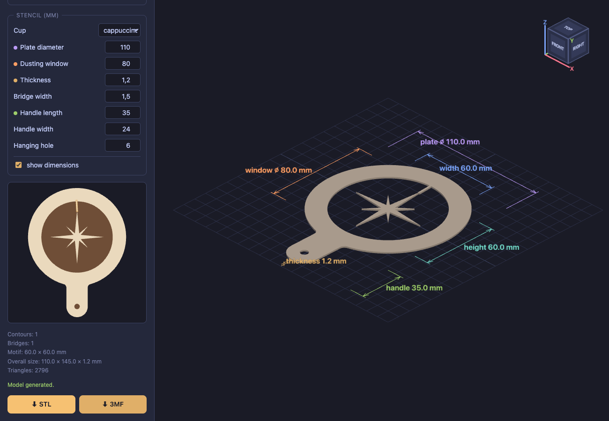

# ☕ Coffee Stencil

**Turn any shape into a 3D-printable latte art stencil.**

Drop in an SVG, PNG or JPG and download a print-ready STL or 3MF — a thin
plate you hold over the cup and dust cocoa or cinnamon through. Everything
runs in your browser; nothing is uploaded anywhere.

### ▶︎ [Open the app → tedyno.github.io/coffeestencil](https://tedyno.github.io/coffeestencil/)



## Features

- **SVG input** — `path`, `rect`, `circle`, `ellipse`, `polygon`; stroke-only
  icons (`fill="none"`) are expanded to outlines of the stroke width
- **PNG / JPG / WebP input** — vectorized live with a tunable brightness
  threshold, inversion, simplification and smoothing
- **Two modes** — powder draws the motif (motif cut out), or powder draws
  around it inside a round dusting window (motif stays light)
- **Automatic bridges** — parts that would fall out of the plate (the inside
  of an "O", letters in negative mode) are tied back with bridges of a set
  width along the shortest path; specks too small to hold are left open
- **Cup presets** — espresso / cappuccino / large mug set the plate, window
  and motif size
- **Handle** with a rounded end and an optional hanging hole
- **Live dusting preview** — cocoa on foam, bridges highlighted
- **STL and 3MF export** — watertight by construction (2D booleans in
  [Manifold](https://github.com/elalish/manifold) + a single extrude)

## Running locally

```sh
bun install
bun run dev        # dev server with hot reload, http://localhost:3000
bun run build      # static build into dist/
```

Built with [bun](https://bun.sh), TypeScript, [three.js](https://threejs.org),
[manifold-3d](https://www.npmjs.com/package/manifold-3d) and
[clipper-lib](https://www.npmjs.com/package/clipper-lib) — no server,
no CDN, local dependencies only.

## How it works

1. **Extract contours** — SVG shapes are sampled via `getPointAtLength`;
   rasters are thresholded and traced with marching squares
2. **Fill the motif** — contours are oriented by nesting depth and unioned,
   so letter counters stay holes while overlapping shapes merge
3. **Cut the openings** — plate outline (disc + handle) minus the motif, or
   minus the dusting window with the motif left standing
4. **Bridge islands** — disconnected parts are joined greedily to their
   nearest neighbour until the plate is one piece
5. **Extrude & export** — binary STL or 3MF in millimetres, z-up
